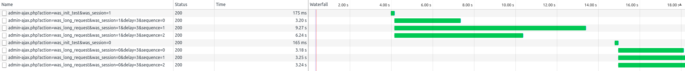

# wp-ajax-session

WordPress sample plugin for illustrating that using session is not a good idea.

Want to use PHP's session in your WP plugins? Please think it again. Using session plugins can hurt performance!

This plugin is created to show you how bad it is. Download install this plgin. Activate it in your *TEST* wordpress site.
You will see 'WAS (WP AJAX Session) Test' menu in the administration screen.

There are two buttons. They triggers AJAX actions that take up about 3 seconds. The first one does its job with session, but the second one does not.
Open your web browser's development console by hitting F12 key and check the result.

The leading four requests are the first button's, and last four are the second button's.
The second button's result is what we expect from AJAX, asynchronous request and response.
But, AJAX responses of the first button become sequential, which leads your impact your plugin's performance degraded seriously.
